# Data Model

Legend: **[built]** migrations 0001–0007, tested · **[planned]** designed, no SQL yet. Planned tables are a proposal and will be
revised after the source audit; no downstream table is built on unverified assumptions (rule 103).

## Conventions (all tables)
`id uuid` PK (internal) · human code/business ID separate and UNIQUE · `created_at/by`, `updated_at/by`, `row_version` stamped by trigger ·
`is_active` soft delete · `effective_from/to` with CHECK · FK on every relation · typed core columns + `custom jsonb` for admin-defined fields (D-004) ·
audit trigger on every business/config table · grants + RLS declared in the same migration as the table (D-003).

## [built] Foundation
| Group | Tables |
|---|---|
| Organisation | entity, location, business_unit, unit, department, designation |
| Reference | authority, law (legal_source + last_reviewed_at), document_type |
| Identity | app_user, role, permission, role_permission, user_role, user_scope |
| Numbering | numbering_rule, number_counter (+ `app.next_business_id`) |
| Audit | audit_log (append-only) |
| Configuration | lov_set, lov_value, field_definition, form_section, form_section_field, field_role_access, rule_definition (+ `app.rule_is_valid`) |
| Platform | module_definition, status_definition, status_transition (+ `app.status_transition_allowed`), system_config (secret-looking keys rejected), config_definition (versioned, immutable once published; `public.config_new_version`) |
| Jobs / health | job_definition (7 seeded: compliance_generation, due_status_refresh, licence_expiry_detection, exception_generation, alert_generation, communication_followup, housekeeping), job_run (unique job+idempotency key; retry/backoff/stale-reclaim), `app.job_start/job_finish`, `public.system_health()` |

## [planned] Domain (by phase)
* **P5 Masters**: employee (authoritative, `employee_code` UNIQUE; org FKs), contractor (CTR-…; type, licence link), compliance_category, compliance_master (law FK, frequency, due-rule JSON AST, evidence requirement, owner, risk, versioned), licence_type, risk/severity as LOV.
* **P6 Compliance**: compliance_applicability (compliance×entity/location/…; state Applicable/NotApplicable/Conditional; reason, source, reviewed_by/at; effective dates; versioned), compliance_instance (**UNIQUE(compliance_id, location_id, period_start)** → idempotent generation), evidence (version chain, Drive file id, verification), exception (+ exception_action), alert_rule / alert / notification, sla_rule, job_run.
* **P8 Contractor**: contractor_requirement (configurable), contractor_period, contractor_period_item, scoring_config, contractor_bill (**UNIQUE(contractor_id, invoice_number)**), bill_hold_rule, bill_hold, bill_deduction.
* **P9 Cases**: esic_case/esic_action, grievance_case/grievance_action (UNIQUE registration no.), disciplinary_case/disciplinary_action (unlimited timeline), liaison_case/liaison_event, plant_visit/observation, capa.
* **P10 Comms**: communication (+recipient, attachment, follow_up), template (versioned), inward_correspondence, outward_correspondence, dispatch_register. Generic `related_module + related_id` link; no FK enforced across modules → integrity via validated `record_ref` function.
* **P11 Data**: import_batch, import_row, import_error, mapping_profile, saved_report.

## ERD (core relationships)

```mermaid
erDiagram
  entity ||--o{ location : has
  entity ||--o{ business_unit : has
  business_unit ||--o{ unit : has
  department ||--o{ department : parent
  app_user ||--o{ user_role : has
  role ||--o{ user_role : grants
  role ||--o{ role_permission : has
  permission ||--o{ role_permission : in
  app_user ||--o{ user_scope : limited_to
  lov_set ||--o{ lov_value : contains
  lov_set ||--o{ field_definition : feeds
  field_definition ||--o{ field_role_access : visibility
  form_section ||--o{ form_section_field : orders
  numbering_rule ||--o{ number_counter : counts
  employee ||--o{ grievance_case : raises
  employee ||--o{ esic_case : concerns
  employee ||--o{ disciplinary_case : subject
  contractor ||--o{ contractor_period : monthly
  contractor_period ||--o{ contractor_period_item : items
  contractor ||--o{ contractor_bill : invoices
  contractor_bill ||--o{ bill_hold : held_by
  compliance_master ||--o{ compliance_applicability : applies
  compliance_master ||--o{ compliance_instance : generates
  compliance_instance ||--o{ evidence : supported_by
  compliance_instance ||--o{ exception : breaches
  licence ||--o{ liaison_case : renewal
  authority ||--o{ licence : issues
  communication }o--|| communication_target : links_any_record
```

(`employee`, `contractor`, `compliance_*`, cases, bills are **[planned]**.)

## Indexing strategy
Index only proven query paths: FK columns, `status`+`due_date` for registers, `(table_name, record_id, at desc)` for audit (built), GIN on `custom` and `pg_trgm` on search keys (planned for global search).

## Dynamic field values (D-004) — storage contract
Business tables get `custom jsonb not null default '{}'` (+ GIN index) **in the migration that creates them**. Keys = `field_definition.key`; values validated against the definition (type, LOV membership, min/max, required/conditional rules) by the write path (RPC/Edge Function, shared Zod schema generated from metadata). Reporting/import/export expand `custom` via `field_definition`. A field that becomes hot is promoted to a typed column by migration with a backfill. Not yet exercised: no business table exists.
