# Data Model

Legend: **[built]** migrations 0001–0007, tested · **[planned]** designed, no SQL yet. Planned tables are a proposal and will be
revised after the source audit; no downstream table is built on unverified assumptions (rule 103).

## Conventions (all tables)
`id uuid` PK (internal) · human code/business ID separate and UNIQUE · `created_at/by`, `updated_at/by`, `row_version` stamped by trigger ·
`is_active` soft delete · `effective_from/to` with CHECK · FK on every relation · typed core columns + `custom jsonb` for admin-defined fields (D-004) ·
audit trigger on every business/config table · grants + RLS declared in the same migration as the table (D-003).

## [built] Foundation
| Group | Tables |
|---|---|
| Organisation | entity, location, business_unit, unit, department, designation |
| Reference | authority, law (legal_source + last_reviewed_at), document_type |
| Identity | app_user, role, permission, role_permission, user_role, user_scope |
| Numbering | numbering_rule, number_counter (+ `app.next_business_id`) |
| Audit | audit_log (append-only) |
| Configuration | lov_set, lov_value, field_definition, form_section, form_section_field, field_role_access, rule_definition (+ `app.rule_is_valid`) |
| Platform | module_definition, status_definition, status_transition (+ `app.status_transition_allowed`), system_config (secret-looking keys rejected), config_definition (versioned, immutable once published; `public.config_new_version`) |
| Jobs / health | job_definition (7 seeded: compliance_generation, due_status_refresh, licence_expiry_detection, exception_generation, alert_generation, communication_followup, housekeeping), job_run (unique job+idempotency key; retry/backoff/stale-reclaim), `app.job_start/job_finish`, `public.system_health()` |

## [planned] Domain (by phase)
* **P5 Masters**: employee (authoritative, `employee_code` UNIQUE; org FKs), contractor (CTR-…; type, licence link), compliance_category, compliance_master (law FK, frequency, due-rule JSON AST, evidence requirement, owner, risk, versioned), licence_type, risk/severity as LOV.
* **P6 Compliance**: compliance_applicability (compliance×entity/location/…; state Applicable/NotApplicable/Conditional; reason, source, reviewed_by/at; effective dates; versioned), compliance_instance (**UNIQUE(compliance_id, location_id, period_start)** → idempotent generation), evidence (version chain, Drive file id, verification), exception (+ exception_action), alert_rule / alert / notification, sla_rule, job_run.
* **P8 Contractor**: contractor_requirement (configurable), contractor_period, contractor_period_item, scoring_config, contractor_bill (**UNIQUE(contractor_id, invoice_number)**), bill_hold_rule, bill_hold, bill_deduction.
* **P9 Cases**: esic_case/esic_action, grievance_case/grievance_action (UNIQUE registration no.), disciplinary_case/disciplinary_action (unlimited timeline), liaison_case/liaison_event, plant_visit/observation, capa.
* **P10 Comms**: communication (+recipient, attachment, follow_up), template (versioned), inward_correspondence, outward_correspondence, dispatch_register. Generic `related_module + related_id` link; no FK enforced across modules → integrity via validated `record_ref` function.
* **P11 Data**: import_batch, import_row, import_error, mapping_profile, saved_report.

## ERD (core relationships)

```mermaid
erDiagram
  entity ||--o{ location : has
  entity ||--o{ business_unit : has
  business_unit ||--o{ unit : has
  department ||--o{ department : parent
  app_user ||--o{ user_role : has
  role ||--o{ user_role : grants
  role ||--o{ role_permission : has
  permission ||--o{ role_permission : in
  app_user ||--o{ user_scope : limited_to
  lov_set ||--o{ lov_value : contains
  lov_set ||--o{ field_definition : feeds
  field_definition ||--o{ field_role_access : visibility
  form_section ||--o{ form_section_field : orders
  numbering_rule ||--o{ number_counter : counts
  employee ||--o{ grievance_case : raises
  employee ||--o{ esic_case : concerns
  employee ||--o{ disciplinary_case : subject
  contractor ||--o{ contractor_period : monthly
  contractor_period ||--o{ contractor_period_item : items
  contractor ||--o{ contractor_bill : invoices
  contractor_bill ||--o{ bill_hold : held_by
  compliance_master ||--o{ compliance_applicability : applies
  compliance_master ||--o{ compliance_instance : generates
  compliance_instance ||--o{ evidence : supported_by
  compliance_instance ||--o{ exception : breaches
  licence ||--o{ liaison_case : renewal
  authority ||--o{ licence : issues
  communication }o--|| communication_target : links_any_record
```

(`employee`, `contractor`, `compliance_*`, cases, bills are **[planned]**.)

## Indexing strategy
Index only proven query paths: FK columns, `status`+`due_date` for registers, `(table_name, record_id, at desc)` for audit (built), GIN on `custom` and `pg_trgm` on search keys (planned for global search).

## Dynamic field values (D-004) — storage contract
Business tables get `custom jsonb not null default '{}'` (+ GIN index) **in the migration that creates them**. Keys = `field_definition.key`; values validated against the definition (type, LOV membership, min/max, required/conditional rules) by the write path (RPC/Edge Function, shared Zod schema generated from metadata). Reporting/import/export expand `custom` via `field_definition`. A field that becomes hot is promoted to a typed column by migration with a backfill. Not yet exercised: no business table exists.

## [built, locally tested] Phase 6 — Compliance core (migrations 0014–0022)
| Area | Objects | Key integrity rules |
|---|---|---|
| Compliance master | `compliance_category`, `compliance_master` (identity + legal reference: law, section, `legal_source`, `last_reviewed_at`), `compliance_rule_version` (frequency, due rule, risk, criticality, evidence flag, `period_start_month`), `compliance_rule_evidence` | Interpretation lives in **versions**; published versions are immutable (trigger); activation is atomic with a mandatory reason (`compliance_activate_rule_version`); due-rule JSON validated by `app.due_rule_is_valid`; type/risk/criticality/domain validated against LOV tables by `app.validate_lov` |
| Applicability | `compliance_applicability` (entity, location, business unit, state, establishment type, industry, employee/contractor headcount ranges; `applicable`/`not_applicable`/`conditional` + whitelisted `condition`; reason, source, reviewed_by/at; effective dates) | In-effect rows are immutable (add a new row); resolution by **specificity**, ties resolve toward *applicable* and are flagged as conflicts; pairs with no decision are **unmapped** (`compliance_coverage()`), never dropped. Department and contractor-type dimensions are deliberately absent until department-level / contractor-level records exist |
| Instances | `compliance_instance` (`CMP-yyyy-nnnnnn`), `v_compliance_instance`, `compliance_calendar()` | **UNIQUE (compliance, location, period_start)** = idempotency key; rule version in force at the period start is recorded; identity/period/due date immutable; status via configurable transitions (`app.enforce_status`), reasons captured in the audit log |
| Generator | `app.compliance_periods`, `app.compute_due_date`, `app.generate_compliance_instances`, `app.run_compliance_generation` (job-logged), `compliance_create_manual_instance` | `ON CONFLICT DO NOTHING`; verified with 8 concurrent runs; event/incident/one-time obligations are created by a person, never the scheduler |
| Licences | `licence_type`, `licence` (`LIC-nnnnnn`, authority+number unique), `licence_event` (append-only), `v_licence_status` | Expiry state is **derived** (`days_to_expiry`, bucket from `system_config licence.expiry_thresholds`, renewal window); renewal chain via `supersedes_id` |
| Evidence | `evidence` (`EVD-yyyy-nnnnnn`), `v_evidence_requirement`, `evidence_replace()` | Drive reference + metadata only; file identity immutable; one current per parent/type/period; replacement keeps the old version with a mandatory reason; verification needs `evidence.verify`; MIME/size enforced from `document_type`; missing/expired derived |
| Exceptions | `exception` (`EXC-yyyy-nnnnnn`), `exception_action`, `v_exception`, `app.detect_exceptions`, `app.run_exception_detection` | One active exception per `detection_key` (partial unique index); severity from rule/licence risk; auto-resolved when the condition clears; recurrence = new record; manual exceptions never auto-resolved |
| Alerts | `notification`, `app.generate_alerts`, `app.run_alert_generation`, alert rules in `config_definition(kind='alert_rule')` (validated shape) | Most recent reached offset within a catch-up window; dedupe key; scope-aware recipients; Head HR fallback; email only when the mail integration is CONFIGURED |
| Dashboard | `compliance_dashboard()` | Computed from RLS-scoped views; refuses callers without `compliance.read`; percentages NULL when nothing is measurable |
| UI RPCs | `compliance_set_status`, `exception_set_status` | SECURITY INVOKER: RLS and every trigger still apply |

Business-id formats: `CMP-2026-000001`, `LIC-000001`, `EVD-2026-000001`, `EXC-2026-000001`, allocated transactionally by `app.assign_business_id` → `app.next_business_id`.

Not yet modelled (by dependency order): employee/contractor masters, contractor compliance & bills, GRC/ESIC/disciplinary/liaison, communications, import batches, saved reports, SLA designer tables (SLA rules live in `config_definition` until their modules exist).

## Master Data Administration and Import (migrations 0026–0031)
Tables added: `import_template`, `import_batch`, `import_row` (48 tables). Views added: `v_compliance_master`, `v_compliance_rule_version`, `v_applicability`, `v_compliance_coverage`, `v_alert_rule`,
`v_alert_routing_issue`, `v_compliance_superseded` (12 views). Columns added: `compliance_instance.human_touched_at/superseded_*` (0025), `compliance_rule_evidence.validity_months/requires_verification/help_text` (0029),
`status_definition.is_system` (0028). Permissions added: `import.read`, `import.manage` (22). See docs/MASTER_DATA_ADMIN.md and docs/IMPORT_FRAMEWORK.md.
